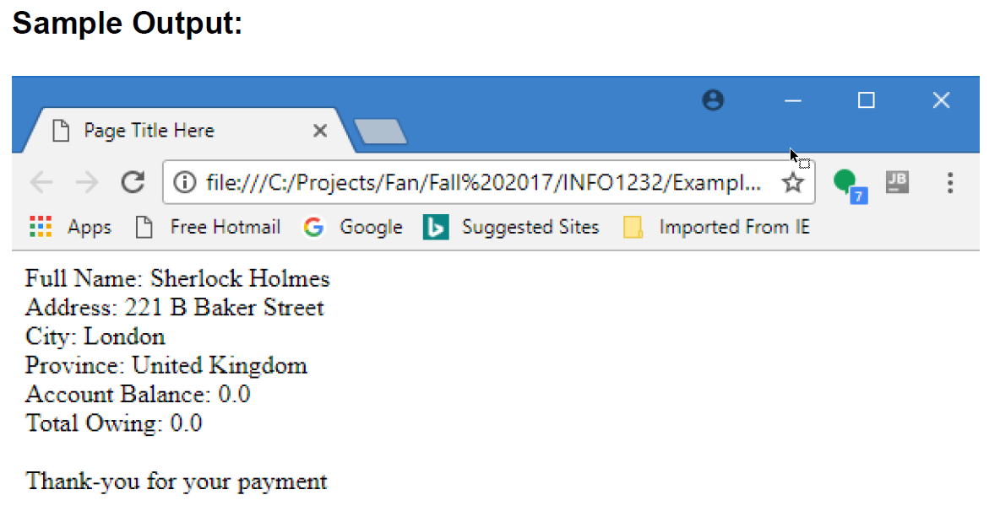

# **Lab Description**

1. Create a single HTML page using the editor of your choice. Name this page based on the following template: your first name followed by an underscore and then “Lab1”. For example, “Jim_Lab1.html”.

2. Use the following template as a starting point for your page:

```html
<html>
  <head>
    <title>Page Title Here</title>
    <script language="JavaScript" type="text/JavaScript">
      // code goes here
    </script>
  </head>
  <body></body>
</html>
```

3. Prompt the user for the following information (using the JavaScript “prompt" function):

   > Full Name: &#x2003;&#x2003;&#x2003;&#x2003;default is “No Name”
   >
   > Address: &#x2003;&#x2003;&#x2003;&#x2003;&#x2003;default is “No Address”
   >
   > City: &#x2003;&#x2003;&#x2003;&#x2003;&#x2003;&#x2003;&#x2003;default is “London”
   >
   > Province: &#x2003;&#x2003;&#x2003;&#x2003;&#x2003;default is “Ontario”
   >
   > Account Balance: &#x2003;&#xA0;default is “0.0”

4. If the account balance is greater than 0 but less than $1000 charge a penalty of 2% on the account balance.

5. If the account balance is greater than or equal to $1000 charge a penalty of 3% on the account balance.

6. Once the penalty (if any) is calculated, output to the screen using `document.write`, all the input data, plus the (new) total amount owing.

7. If the account balance is zero, output a message that says “Thank-you for your payment”

8. It’s not a requirement to format or round any of the dollar amounts as displayed.

# Sample Output:

