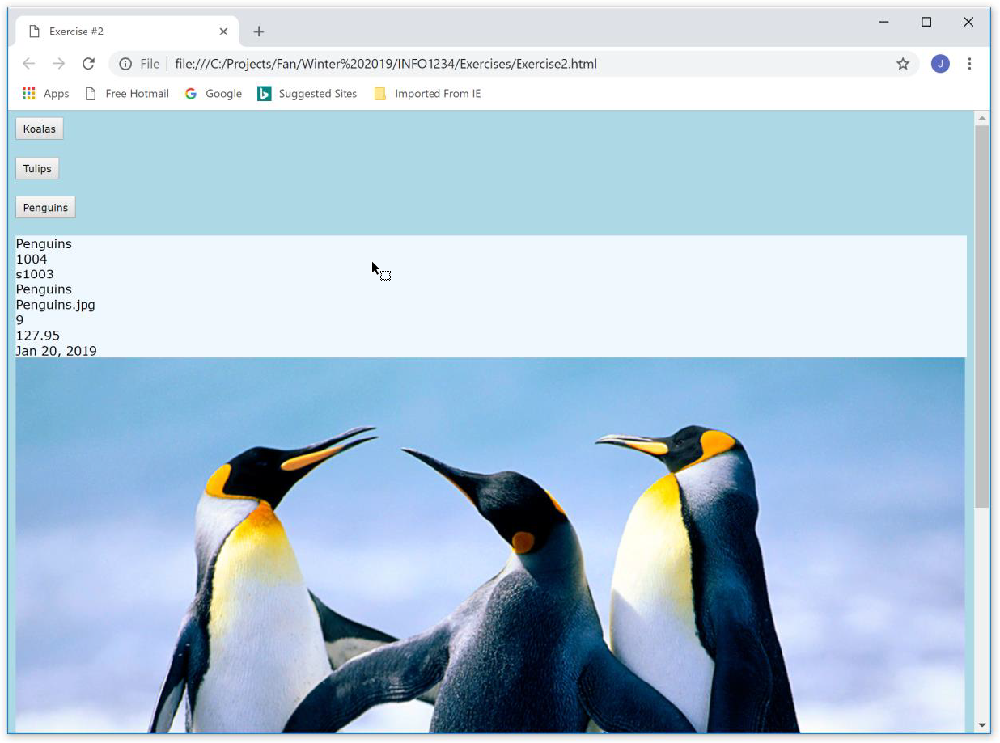

# **Lab Description**

1. Create a single HTML page using the editor of your choice. Name this page using the following template: your first name followed by an underscore and then “Lab2”. For example, “Jim_Lab2.html”.

2. Use the following template as a starting point for your page:

```html
<html>
  <head>
    <title>Page Title Here</title>
    <script language="JavaScript" type="text/JavaScript">
      // code goes here
    </script>
  </head>
  <body></body>
</html>
```

3. This exercise is somewhat based on the ObjectLiterals example we did in class (koalas, tulips and penguins).

4. Use the w3schools colour picker web site to help you create a colour theme for your web page or use your own style sheet.
<https://www.w3schools.com/colors/colors_picker.asp>

5. Modify the approach taken (object literals) in the ObjectLiterals.html example (from week 2) to use a constructor function that will create the three objects (koala, tulip and penguin).

6. Use the same data we worked with in the ObjectLiterals example, however we want you to add a new property to each object called “dateCreated”.

7. The date created property should be the current date formatted as: MMM dd, YYYY. For example: Jan 23, 2019.

8. As we did with the ObjectLiterals example, create 3 buttons and a single event handler that manages input from all of the buttons. The name of the event handler should be showProperties and it should display all the properties for the specified object in the usual “outputStuff \<div>.

9. Remember to have each button “tell” the event handler who is calling as this will enable you to know which object to use for displaying the property values.

# Sample Output:

