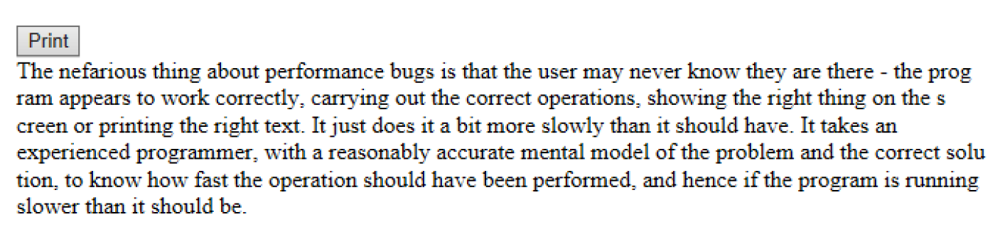

# **Lab Description**

1. Begin by creating a single HTML page called <my first name>_Lab4.html. As an example: “Jim_Lab4.html”

2. Add a button with id btnPrint and value “Print” and an event handler called printString()

3. The examples studied in the most recent recording dealt with performing animations and providing “cycle time” for the UI (User Interface) using setTimeout to recursively call a function that automatically performs a single step in a multi-step process. In this case, we want you to print out the highlighted text which follows, a single character at a time with a 10-millisecond delay between each character being displayed.

> The nefarious thing about performance bugs is that the user may never know they are there - the program appears to work correctly, carrying out the correct operations, showing the right thing on the screen or printing the right text. It just does it a bit more slowly than it should have. It takes an experienced programmer, with a reasonably accurate mental model of the problem and the correct solution, to know how fast the operation should have been performed, and hence if the program is running slower than it should be

4. You should also add a \<div> which will be used to receive (and display) the characters in the string incrementally. This would look something like:

````html
    document.getElementById("outDiv").innerHTML += myNextChar;
````

5. Display 100 characters on a line and then start a new line, continuing until all the characters have been displayed.

6. Your output should look something like:
