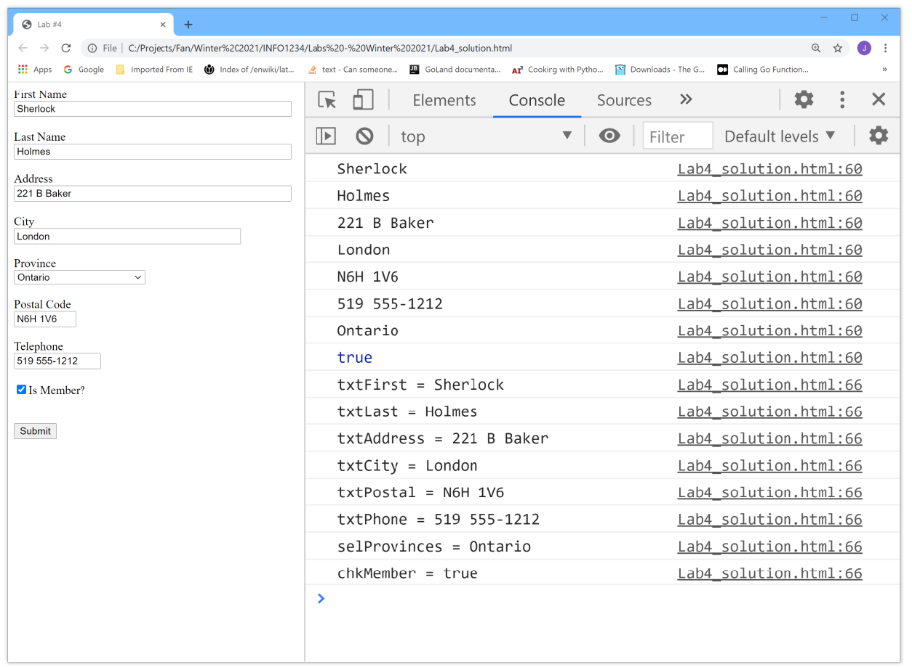

# **Lab Description**

1. Take your initial web page, Lab4.html and rename it for use with this exercise. For example: “Jim_Lab4.html”.

2. The purpose of this lab is to extend the “Submit” button event handler to make use of both a set (collection) and a map.

3. Begin by converting all existing “var” declarations to “let” declarations. For any new variables you create, use the “let” (block scope) format.

4. Next create a “set” (collection) object called “dataSet” that contains all the text boxes, province selected and “is member” checkbox (true or false) information. You’ll need to use the add method to insert each piece of control status information into the set.

5. Also create a map object called “dataMap” and add all of the same control information to this object. You’ll need to use the .set method to perform the insert. Use the control “id” as the “key” and use the relevant information from each control (e.g. text box “value”) as the map “value”

6. Note that both “dataset” and “dataMap” must be declared within the “submit” function.

7. Create a function called dumpSet(dataSet) and a function called dumpMap(dataMap) to print out to the console (console.log) all the “value” elements in your “set” and all the “keys and “values” in your map.

8. With this kind of programming activity, you can save yourself a lot of time testing by assigning default values to all the controls within the web page. As such, you won’t need to type data into the text boxes, each time you test your web page.

# Sample Output:

