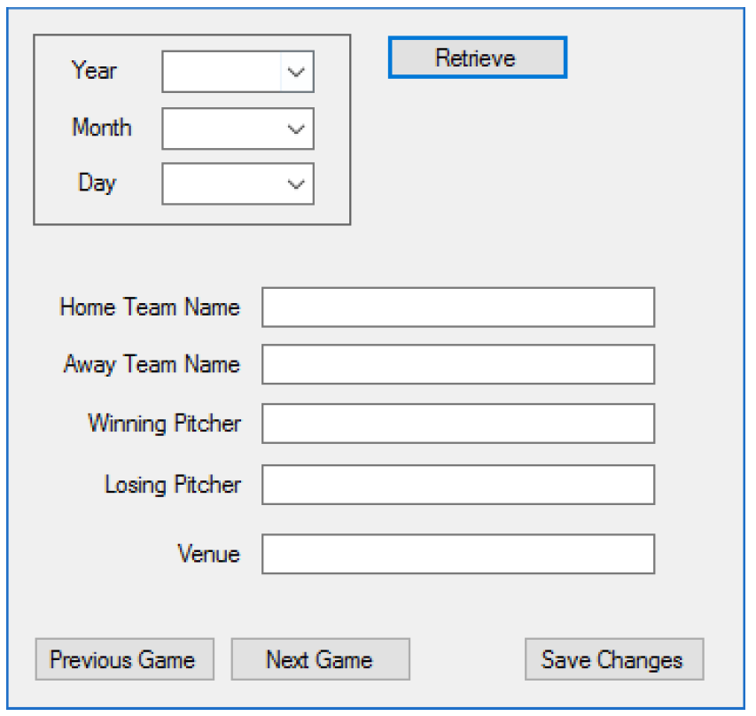
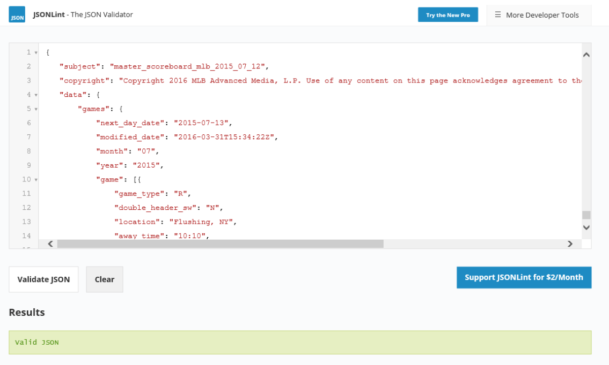
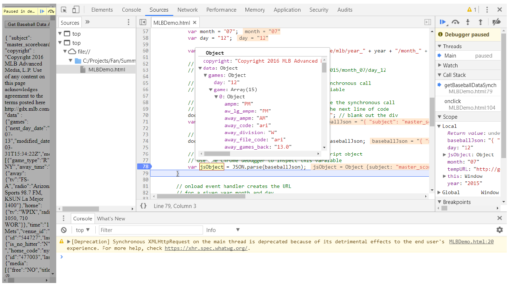

# **Project Description**

This project is based on the MLB Demo example that’s been provided to you recently. The demo page contains the JavaScript code required to retrieve data (JSON format) from the Major League Baseball site on the world wide web. Each retrieval is based on a specific day and requires a year, month and day to be specified. In addition, the demo example shows both synchronous and asynchronous strategies for retrieving the JSON data.
The objective of this project is to:

1. Retrieve a set of baseball data for a given date

2. Provide the user with the opportunity to edit a small subset of the data for each of the games

3. Save the changes to a local database (we won’t actually save any changes with this project although you should have a fake button as part of the user interface)

# **Specific Requirements:**

Create a basic user interface that looks somewhat like the following. You should use your own colours and fonts to create something that’s professionally attractive.



When the page loads, the user will need to select a year, month and day from 3 \<select> pulldown lists:
* The Year pulldown should have 3 options: 2015, 2016 and 2017
* The Month pulldown should have 12 options: 01, 02, 03 … 12
* The Day pulldown should have 31 options: 01, 02, 03 … 31

We won’t worry about validating any of the selected dates.

When the user clicks the “Retrieve” button, user an AJAX call to the MLB online site to retrieve the JSON for the specified day. Use an asynchronous XMLHttpRequest request to retrieve the data.

Your URL for issuing a request should look something like the following:
`http://gd2.mlb.com/components/game/mlb/year_2015/month_07/day_12`

When you receive the JSON data back from the site, you’ll want to “parse” it into a JavaScript object in order to get access to the individual properties that you’ll need to populate the form.

Something like:
````
var jsObject = JSON.parse(baseballJson);
````

In addition, you’ll notice that the JSON string contains an array of objects where each element stores the set of properties for each of the games played on the specified day. This is called the “game” array which is part of the “games” object which is in turn part of the “data” object. See the “Notes” below for a detailed description of how to thoroughly analyze an unformatted JSON string.

As an example, given the declaration of the “jsObject” variable above:
````
jsObject.data.games.game[0]
````

gives us access to the `game[0]` object.

From here we want to allow the user to display and edit only 7 properties from the property data for each game:

> home_team_name
>
> away_team_name
>
> winning_pitcher.first
>
> winning_pitcher.last
>
> losing_pitcher.first
>
> losing_pitcher.last
>
> venue

When you display the pitcher names, you will need to concatenate the first and last names for each pitcher.

Once you have the JSON data returned and converted to a JavaScript object, display the information for the first game of the day. The user may then load the set of properties for the next game in the game array by clicking the “Next Game” button. Similarly, if the user is not currently positioned at the first game, they can load the properties for the previous game into the game array by clicking the “Previous Game” button.

Remember as well, that the <u>**“Save Changes” button won’t be operational for this project**</u>.

It is not a requirement that you create your JavaScript code and CSS code in separate files although you may choose to do so.

*** **End of Requirements** ***

# **Notes:**

There are several strategies that can be employed to try and understand the contents of a complex JSON string:

1. Format a sample of the string using JSON Lint as described in the AJAX slide set.


2. Copy the formatted JSON into a text editor and save the new JSON file as \<filename>.json. This step allows you to search the formatted JSON looking for specific properties.

3. Use the Chrome debugger to display the properties of the JavaScript object that is created when the JSON is “parsed.” This will allow you to drill-down and inspect the object in great detail. This is done by setting a break-point near or after you’ve “parse” the JSON string into a JavaScript object. You can then hover the mouse pointer over the object variable and Chrome will display the pop-up showing the detailed drill-down.
