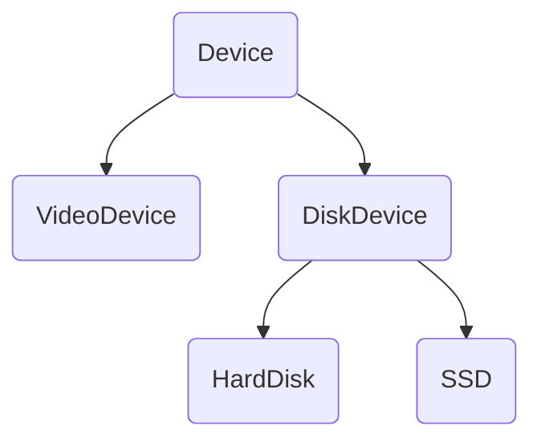
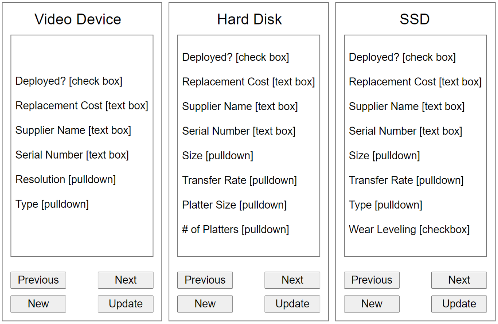

# **Project Description**

This project is about starting with a class-hierarchy design and then using that design to build a simple web user interface to enable viewing and editing the properties of any objects created.

The main concept here is to create a simulated controller that allows all devices of a specific type to be monitored, updated, enabled and disabled.

# **Specific Requirements:**

## <u>**Create the following set of classes:**</u>

1. Create a base class called “Device”

2. Create two derived classes “VideoDevice” and “DiskDevice” that both inherit from “Device”

3. Create two more derived classes “HardDisk” and “SSD” that both inherit from “DiskDevice”

For the purpose of this project, “VideoDevice” does not have any derived classes.

### <u>**Device Class:**</u>

This class must have a boolean property called “deployed” which indicates whether the particular device has been deployed to the field or is still sitting on the shelf. You should control the status of “deployed” with a getter and a setter and use “_deployed” as the hidden internal property.

Several other properties that you’ll want to track in the base class are:

> Replacement Cost ($)
>
> Supplier Name (string)
>
> Serial Number (string)

These properties should also be managed with getters and setters and should have hidden internal versions that are prefixed with underscores in the usual way.

### <u>**Video Device Class:**</u>

This class needs the following properties:

> Resolution (string) – example: “3840 x 2164”
>
> Type (string) (one of LCD, LED, Plasma)

### <u>**Disk Device Class:**</u>

This class needs the following properties:

> Size: (string) – example: “4TB”
>
> Transfer Rate (string) – example: “7GB / second”

### <u>**Hard Disk Class:**</u>

This class needs the following properties:

> Platter Size: (string) – example: “2.5 inches”
>
> Number of Platters (integer)

### <u>**SSD Class:**</u>

This class needs the following properties:

> Type: (string) (one of Flash, DRAM)
>
> Wear Leveling: (boolean)

## <u>**Create a user interface to manage the objects you create:**</u>

Your UI should consist of 3 panels, each of which provides the tools to manage one of, a video device object, a hard disk object or an SSD object (see the diagram on the next page).

There is a 2 mark grade component for creating a reasonably styled web page with relevant HTML controls.

Each panel should be able to:

1. Create a new object of the specific type (including all inherited properties)
2. Update all properties for the currently visible device object.
3. Switch to the next (or previous) device and edit (or view) its properties.

Your UI should contain controls such as text boxes for editing string values (no character filtering is required), pulldowns for selecting a “one of” value, and check boxes to change status properties (“on or off”).

You’ll need to keep an array of each object type to facilitate the ability to switch to the next or previous object.

Also remember that each panel must provide the ability to edit all properties from the base class on down through all derived classes.

We are not including any way to delete a device object although that might reasonably be included in this kind of application.

*** **End of Requirements** ***